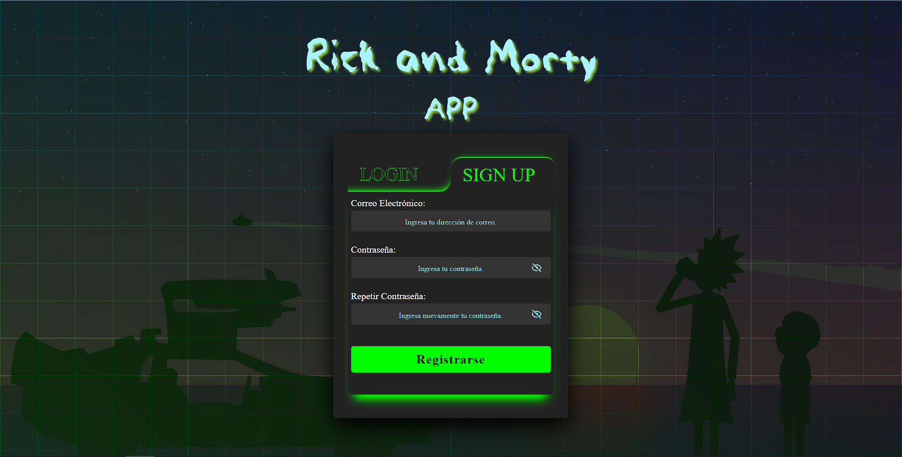
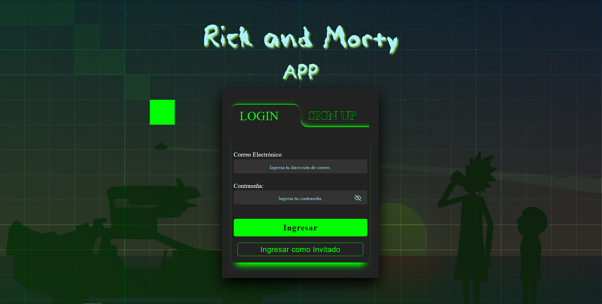
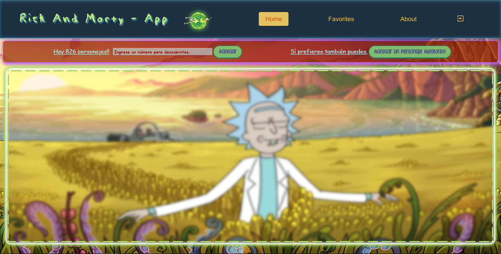
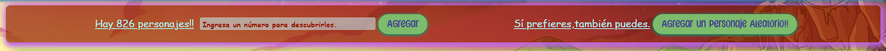
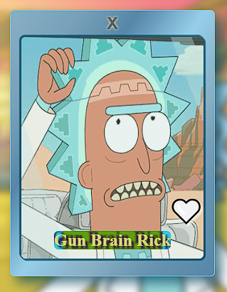
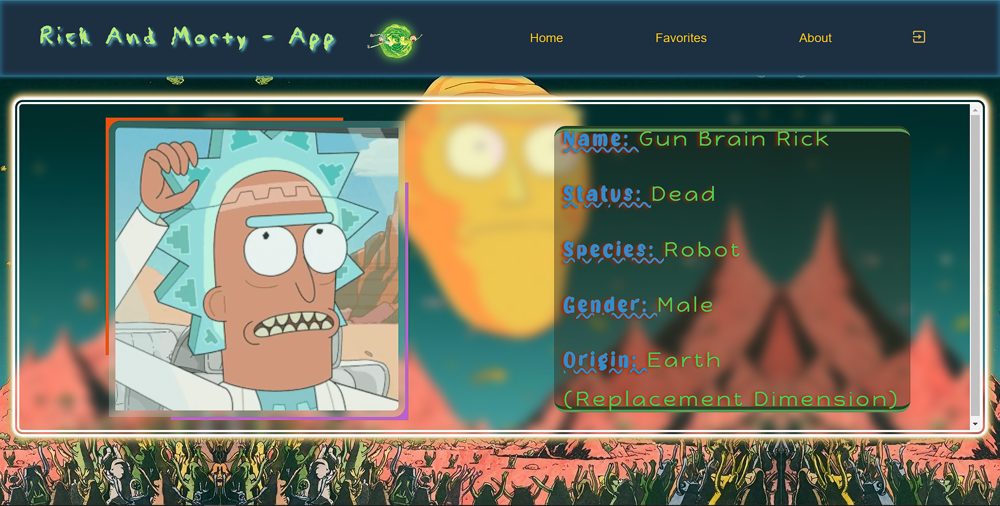

# Rick and Morty App

## Descripción

Este proyecto es una aplicación desarrollada durante el bootcamp de Henry, con el propósito de poner en práctica los conocimientos teóricos adquiridos durante la cursada. La aplicación está construida utilizando una combinación de tecnologías como React, Redux y JavaScript para el desarrollo del frontend, mientras que para el backend se emplean Node.js y Express.

El frontend de la aplicación se desarrolló utilizando React, un framework de JavaScript ampliamente utilizado para la construcción de interfaces de usuario interactivas. Redux, por otro lado, se utilizó para gestionar el estado de la aplicación de manera eficiente, permitiendo un flujo de datos predecible y mantenible.

En cuanto al backend, se emplearon Node.js y Express para crear una API RESTful que maneja las solicitudes del cliente y gestiona la lógica del servidor. Node.js es un entorno de tiempo de ejecución de JavaScript que permite ejecutar código JavaScript fuera del navegador, mientras que Express es un framework de aplicaciones web para Node.js que simplifica el desarrollo de servidores web.

Además, se utilizó CSS modular para estilizar la interfaz de usuario y mejorar la experiencia del usuario en términos de diseño y presentación.

---

Esta es una versión corregida del proyecto desarrollado durante el bootcamp. Ha sido revisada con el objetivo de mejorar la claridad y la legibilidad del código, así como de incorporar algunas mejoras adicionales. Una de las principales mejoras consiste en la adición de un formulario de registro de usuarios, que permite a los nuevos usuarios registrarse en la aplicación.

Además, se ha implementado una opción de inicio de sesión para usuarios invitados, que les permite acceder a la aplicación sin necesidad de registrarse. Sin embargo, cabe destacar que esta opción no guarda los datos de personajes favoritos cuando se cierra la sesión.

Se ha añadido la funcionalidad de guardar datos en el almacenamiento local (local storage), lo que permite mantener los listados de personajes y los personajes favoritos mientras la sesión está activa. También se han modificado los estados globales y las funciones encargadas de gestionar el inicio y cierre de sesión, para aprovechar estas características de manera eficiente.

Estas mejoras no solo contribuyen a una experiencia de usuario más fluida, sino que también garantizan una mayor persistencia de los datos y una gestión más eficaz de la sesión del usuario.

## Instalación

### Requisitos Previos
- Node.js instalado en tu sistema. Puedes descargarlo [aquí](https://nodejs.org/).

### Pasos de Instalación
1. Clona el repositorio desde GitHub:
   ```bash
   git clone https://github.com/tu_usuario/rick-and-morty-app.git

  Si prefieres, también puedes descargar el código fuente como un archivo ZIP y descomprimirlo en tu computadora.

2. Accede al directorio del proyecto:
   ```bash
   cd rick-and-morty-app

3. Instala las dependencias del proyecto utilizando npm (Node Package Manager), en cada una de las carpetas principales "server" y "client":
   ```bash
   npm install
  Este comando instalará todas las dependencias necesarias que se encuentran en el archivo 'package.json'.

### Configuración del Entorno

Crea un archivo .env en la carpeta server y configura las variables de entorno necesarias, como las credenciales de la base de datos o las claves de API. Puedes encontrar un ejemplo de las variables necesarias en el archivo .env.example.

### Ejecución del Proyecto

Una vez completados los pasos anteriores, puedes ejecutar el proyecto localmente:

1. Para iniciar el servidor de desarrollo, abre la consola desde la carpeta server, y utiliza el siguiente comando:
   ```bash
   npm start
  Esto iniciará el servidor y la aplicación estará disponible en tu navegador en la dirección 'http://localhost:3001/'.

2. Para iniciar la app de react , abre la consola desde la carpeta client , y utiliza el siguiente comando:
   ```bash
   npm run dev

¡Listo! Ahora puedes comenzar a utilizar la aplicación y explorar sus funcionalidades.

## Uso

Para empezar a utilizar la aplicación, simplemente sigue estos pasos:

1. **Registro e Inicio de Sesión**: Si eres un nuevo usuario, puedes registrarte utilizando el formulario de registro.
   
    

   Después de registrarte, inicia sesión con tus credenciales utilizando el formulario correspondiente.
   También tienes la opción de ingresar sin registrarte utilizando el botón 'Ingresar Como Invitado'.
   
    

2. **Explora Personajes**: Una vez que hayas iniciado sesión, podrás explorar una amplia variedad de personajes de la serie "Rick and Morty" en la sección "Home".

   
  
   Utiliza la barra de búsqueda e ingresa un número entre 1 y 826 para agregar una tarjeta de personaje específico. También puedes utilizar el botón "Agregar un personaje aleatorio" para         añadir una tarjeta de personaje al azar.

    

3. **Tarjeta de Personaje**: Una vez que se haya agregado una tarjeta al panel principal, podrás manejarla con las siguientes opciones:

      

      * La "X" en la parte superior te permite eliminar una tarjeta del panel principal.
      * Si te gusta el personaje que muestra la tarjeta, puedes agregarlo a tu lista de personajes favoritos utilizando el botón en forma de corazón. También puedes quitarlo de tu lista de 
        favoritos utilizando el mismo botón.
      * Además, puedes utilizar el nombre del personaje como un enlace a la sección "Details", que muestra los datos más destacados del personaje.

    


